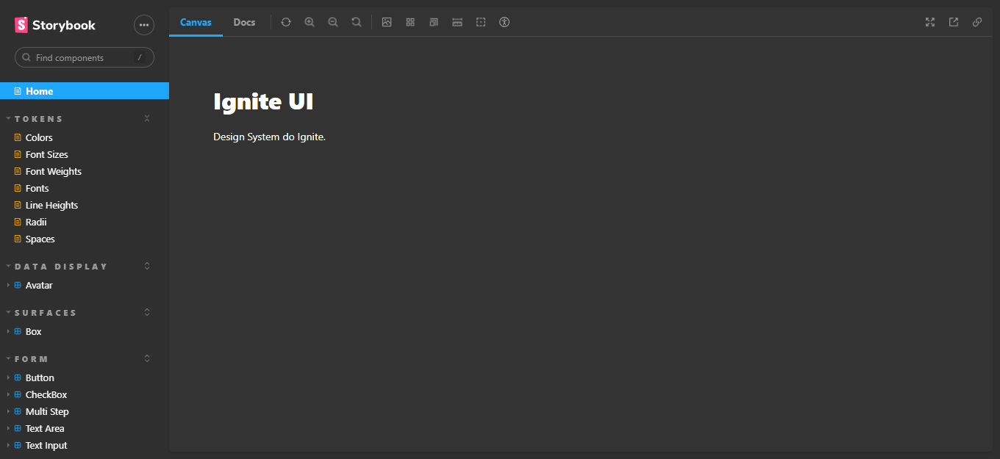

# Design System

[Clique aqui para acessar](https://gadiegon.github.io/05-design-system/)

## Tokens

- [x] Colors
- [x] FontSizes
- [x] FontWeights
- [x] Fonts
- [x] LineHeights
- [x] Radii
- [x] Spaces

## Components

- [x] Text
- [x] Heading
- [x] Box
- [x] Button
- [x] TextInput
- [x] TextArea
- [x] CheckBox
- [x] Avatar
- [x] MultiStep

## Tecnologias utilizadas

- Monorepo
- TypeScript
- Eslint
- Stitches
- Storybook
- TurboRepo
- Addon
- Github
- CI/CD